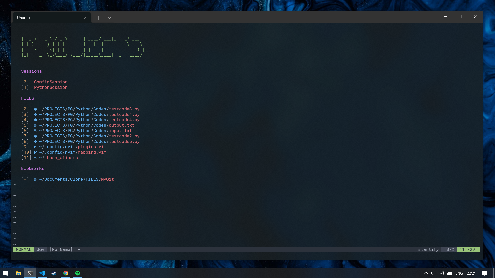

# 1 USER : 1 NEOVIM

This is my Neovim configuration for both Windows and Linux (Ubuntu). Since I barely understood my Linux class which is in Japanese, I am a self-taught student most of the time in school and at home. I used to operate nvim with my professor's configurations but after a while, I realized 2 things. One, nvim rocks! And two, how awesome it would be if I use nvim with my own configurations! 

I will try to make my configurations simple, documented and organized as much as I can. You can download or clone this repository but I do not recommend it! Configurations only makes sense if you are the one who created it.

If you're not yet comfortable creating your own configuration then feel free to use this! You might find some settings, mappings or key bindings that you might like and eventually add it to your very own nvim configuration next time.

## So what's up with my nvim config?

> It's minimal, simple and user-friendly.



#
### **INSTALLATION**

Run this command in your terminal. Make sure you have curl installed!  
**Note:** Read [nvim.sh](./nvim.sh) for details of the command.

```bash
bash <(curl -s https://raw.githubusercontent.com/s20016/nvim/master/nvim.sh)
```

#
<h5 align=right>See <a href="https://github.com/s20016/nvim/wiki">Wiki</a> for details.<h5>