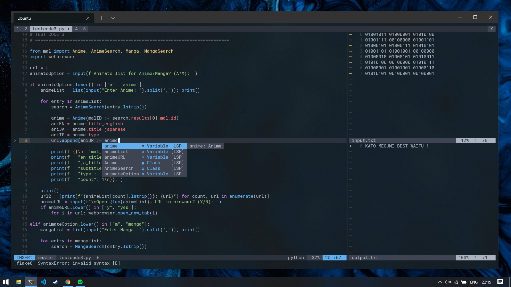

> Requires NVIM v0.5.0+

```bash
.config/nvim/
  ├── init.vim      # Plugin / source path
  ├── mapping.vim   # Key mapping / autocmd
  ├── plugins.vim   # Plugin Settings
  └── setting.vim   # Options
```



